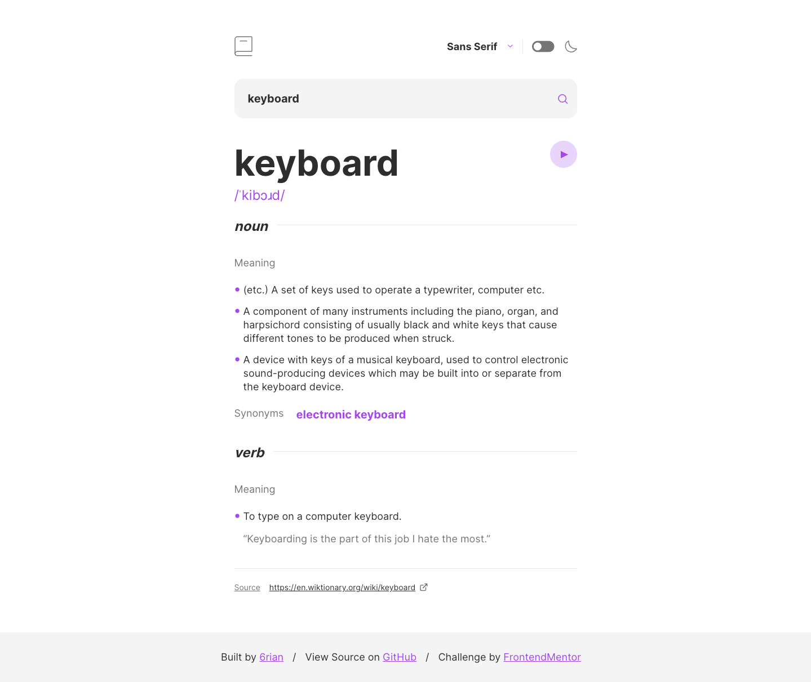

# Frontend Mentor - Dictionary web app solution

This is a solution to the [Dictionary web app challenge on Frontend Mentor](https://www.frontendmentor.io/challenges/dictionary-web-app-h5wwnyuKFL). Frontend Mentor challenges help you improve your coding skills by building realistic projects. 

## Table of contents

- [Frontend Mentor - Dictionary web app solution](#frontend-mentor---dictionary-web-app-solution)
  - [Table of contents](#table-of-contents)
  - [Overview](#overview)
    - [The challenge](#the-challenge)
    - [Screenshot](#screenshot)
    - [Links](#links)
  - [My process](#my-process)
    - [Built with](#built-with)
    - [What I learned](#what-i-learned)
    - [Continued development](#continued-development)
    - [Useful resources](#useful-resources)
  - [Author](#author)

## Overview

### The challenge

Users should be able to:

- [x] Search for words using the input field
- [x] See the Free Dictionary API's response for the searched word
- [x] See a form validation message when trying to submit a blank form
- [x] Play the audio file for a word when it's available
- [x] Switch between serif, sans serif, and monospace fonts
- [x] Switch between light and dark themes
- [x] View the optimal layout for the interface depending on their device's screen size
- [x] See hover and focus states for all interactive elements on the page
- [x] **Bonus**: Have the correct color scheme chosen for them based on their computer preferences. _Hint_: Research `prefers-color-scheme` in CSS.

### Screenshot

### Links

- Solution URL: [Add solution URL here](https://your-solution-url.com)
- Live Site URL: [Add live site URL here](https://your-live-site-url.com)

## My process

### Built with

- Semantic HTML5 markup
- CSS custom properties
- Flexbox
- Mobile-first workflow
- [TypeScript](https://www.typescriptlang.org/)
- [React](https://reactjs.org/)
- [SCSS](https://sass-lang.com/)

### What I learned

Even though this is a small app with a shallow component tree, I wanted to combine use of React's context and reducer hooks to set up global state. In my opinion, isolating state updates to a reducer results in cleaner components and was worth the little bit of overhead the setup added.

This allowed me to easily update the search field's content when the definition changes due to the user clicking on links within definitions, made the `<App>` component more focused, and eliminated some prop drilling.

### Continued development

- [ ] Add unit tests
- [ ] Cache API responses

### Useful resources

- [`useReducer()`](https://react.dev/reference/react/useReducer)
- [`useContext()`](https://react.dev/reference/react/useContext)

## Author

- Website - [6rian.com](https://6rian.com)
- Frontend Mentor - [@6rian](https://www.frontendmentor.io/profile/6rian)

